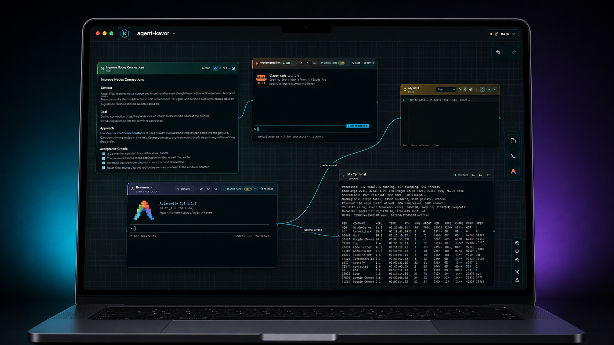

# Kavor — Local-First Coding Agent Orchestrator

Kavor is a visual workspace for coordinating coding agents, terminals, Specifications, files, Git worktrees, and
human decisions on one Canvas.

It keeps the engineering context around AI-assisted development visible and durable instead of burying it across
disposable chat sessions.

[Download Kavor](https://download.agentkavor.com) · [Visit agentkavor.com](https://agentkavor.com) ·
[Join the Discussions](https://github.com/digows/agentkavor-community/discussions) ·
[Follow Building Kavor](building-kavor/README.md)

## Why Kavor

Coding agents made implementation dramatically cheaper. The harder problem is now coordinating the work around
them: preserving context, making authorization visible, reviewing proposed changes, and understanding how one
agent's output affects the rest of the system.

Kavor provides a user-owned control plane for that work:

- **Visual orchestration:** arrange CodingAgents, terminals, Specifications, files, and notes as connected Nodes.
- **Provider choice:** use different coding-agent providers without turning the Workspace into a provider-specific
  workflow.
- **Visible authorization:** Connections grant capabilities; Guardrails make restrictions explicit.
- **Durable context:** Specifications and files remain first-class engineering objects outside any one agent
  session.
- **Human review:** agents can propose Canvas changes, but the user decides whether the atomic proposal is applied.
- **Local-first operation:** repositories, terminals, credentials, and provider sessions stay under the user's
  control.

## See Kavor in action

[Watch the full-quality 38-second demonstration](assets/kavor-demo.mp4).

## Building Kavor

Kavor is built through experiments, hard questions, and evidence from real workflows. **Building Kavor** shares
that process before every answer is polished or final.

The first track investigates **Visible Agent Capabilities**: coding agents already have instructions, tools,
plugins, MCP servers, and connections, but can the person using them clearly see and control what each agent can do?

[Read Building Kavor: Visible Agent Capabilities](building-kavor/visible-agent-capabilities/README.md).

## Get involved

You do not need to write product code to help shape Kavor.

| If you want to… | Go here |
| --- | --- |
| Follow current product experiments | [Building Kavor](building-kavor/README.md) |
| Suggest a workflow or feature | [Ideas](https://github.com/digows/agentkavor-community/discussions/categories/ideas) |
| Ask how something works | [Q&A](https://github.com/digows/agentkavor-community/discussions/categories/q-a) |
| Share what you built or learned | [Show and tell](https://github.com/digows/agentkavor-community/discussions/categories/show-and-tell) |
| Report a reproducible problem | [Bug report](https://github.com/digows/agentkavor-community/issues/new?template=bug-report.yml) |
| Report a vulnerability | [Private vulnerability report](https://github.com/digows/agentkavor-community/security/advisories/new) |

Ideas start as Discussions so people can add context, challenge assumptions, and vote. Confirmed bugs belong in
Issues. Security reports must remain private.

## About this repository

This repository is Kavor's public community and release hub. It contains community documentation, public product
experiments, participation forms, and downloadable releases. The Kavor product source is maintained separately.

Before participating, read [CONTRIBUTING.md](CONTRIBUTING.md), [CODE_OF_CONDUCT.md](CODE_OF_CONDUCT.md),
[SUPPORT.md](SUPPORT.md), and [SECURITY.md](SECURITY.md).
